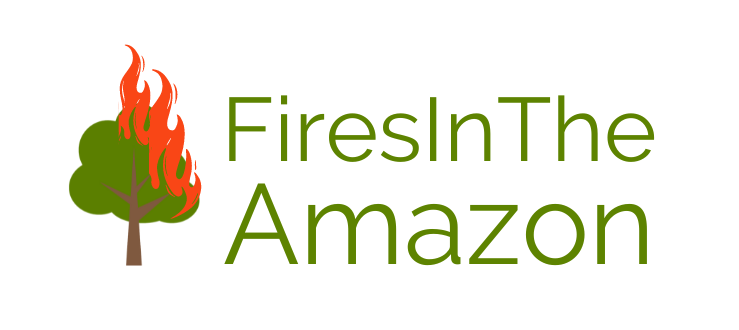

# firesintheamazon

### Sobre:
O projeto é produto do trabalho de iniciação científica do IFAM e possui o objetivo experimental de construir uma aplicação a fim de auxiliar o combate de queimadas na Amazonia.

### Funcionalidades:
- Classificar uma imagem.
- Classificar múltiplas imagens.

Projeto finalizado, porém com pretensões de melhorias e refatoração futura.

Versão: 1.1

Project FITA: Fires in the Amazon
